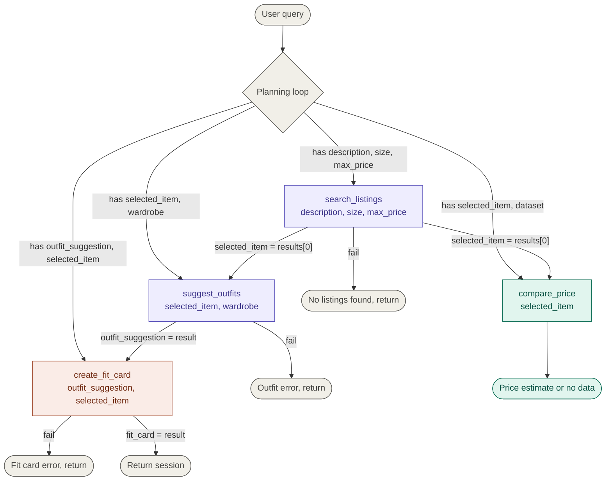

# FitFindr — planning.md

> Complete this document before writing any implementation code.
> Your spec and agent diagram are what you'll use to direct AI tools (Claude, Copilot, etc.) to generate your implementation — the more specific they are, the more useful the generated code will be.
> Your planning.md will be reviewed as part of your submission.
> Update it before starting any stretch features.

---

## Tools

List every tool your agent will use. For each tool, fill in all four fields.
You must have at least 3 tools. The three required tools are listed — add any additional tools below them.

### Tool 1: search_listings

**What it does:**
This tool takes in a description, size, and maximum price from the user, queries against the clothing in the database, and returns the top 3 matching listins sorted by relevance.

**Input parameters:**
- `description` (str): A description/context of what the user is looking for
- `size` (str): The size the user is looking for
- `max_price` (float): The maximum amount a user is willing to spend on the piece of clothing

**What it returns:**
The return is a list with three dictionaries inside. The dictionaries contain the clothing title, price, brand, and condition. FitFindr returns the top result which would be the 0 index.

[
     {
          title: string,
          price: string,
          brand: string,
          condition: string
     },
]

**What happens if it fails or returns nothing:**
If search_listings returns nothing, FitFindr tells the user what to try differently and stops the flow. It does not proceed with a second tool call.

---

### Tool 2: suggest_outfit

**What it does:**
This tool takes in a user's new item along with the user's wardrobe and returns a suggested outfit by pairing the new item with a piece of clothing in the user's wardrobe.

**Input parameters:**
- `new_item` (dict): This represents the piece of clothing the user is looking for
- `wardrobe` (dict): This represents the clothing the user already has

**What it returns:**
A string message on what to pair with the new item and how to wear/style it.

**What happens if it fails or returns nothing:**
If the wardrobe is empty or no outfits can be suggested, the agent should inform the user that it is unable to suggest outfits at the moment.

---

### Tool 3: create_fit_card

**What it does:**
Converts the outfit suggestion into a caption.

**Input parameters:**
- `outfit` (dict): the output (suggestion) from step 2

**What it returns:**
returns a string, caption like, highlighting what was thrifted and what the user liked about the item

**What happens if it fails or returns nothing:**
The agent should inform the user that it was unable to create a string/caption from the input provided and to try again.

---

### Additional Tools (if any)

### Tool 4: compare_price

**What it does:**
Evaluates whether the selected listing's price is fair by comparing it against similar items in the dataset, giving the user a sense of market value before committing.

**Input parameters:**
- output of search_listings (dict): The top result returned from the user's request
- dataset (dict): The data available to compare the new item to
-- I orignially passed this in but removed it and load it directly into the function instead. Could be a feature later to allow users to upload datasets.

**What it returns:**
returns a string comparing the top result to the other results in the dataset

**What happens if it fails or returns nothing:**
The agent should inform the user that it was unable to make a comparison and allow the flow to continue.

---

## Planning Loop

**How does your agent decide which tool to call next?**
When a user passes in a query, we determine if it makes more sense to call search_listings, suggest_outfits, create_fit_card, or compare_price first. If any of the stages fail or return nothing, they return a message to the user specified in the tools section and do not call the other tools. The flow only travels downwards with search_listings at the top taking in description, size, and max price. If the call was successful, we store the first index result in a variable and pass it to suggest_outfits and compare_price. If suggest_outfits was successful, store the output in a variable to pass it in to create_fit_card.

---

## State Management

**How does information from one tool get passed to the next?**
After each tool call, the output is stored in a named variable. The listing returned by search_listings is stored and passed as new_item to both suggest_outfit and compare_price. The outfit suggestion from suggest_outfit is stored and passed as outfit to create_fit_card. The user's wardrobe and preferences are captured at the start of the session and held in memory for the duration of the interaction."

---

## Error Handling

For each tool, describe the specific failure mode you're handling and what the agent does in response.

| Tool | Failure mode | Agent response |
|------|-------------|----------------|
| search_listings | No results match the query | The agent informs the user to try again with different input. |
| suggest_outfit | Wardrobe is empty | The agent informs the user it was unable to suggest an outfit with the provided input. |
| create_fit_card | Outfit input is missing or incomplete | Agent informs the user it was unable to create the text and to try again with different input. |
| compare_price | Invalid input or no results match | Agent informs the user it does not have enough data and to try again with a different piece. |

---

## Architecture

---

## AI Tool Plan

<!-- For each part of the implementation below, describe:
     - Which AI tool you plan to use (Claude, Copilot, ChatGPT, etc.)
     - What you'll give it as input (which sections of this planning.md, your agent diagram)
     - What you expect it to produce
     - How you'll verify the output matches your spec before moving on

     "I'll use AI to help me code" is not a plan.
     "I'll give Claude my Tool 1 spec (inputs, return value, failure mode) and ask it to implement
     search_listings() using load_listings() from the data loader — then test it against 3 queries
     before trusting it" is a plan. -->

**Milestone 3 — Individual tool implementations:**
I will be using Claude for all of the tool implementations. I will give it the specific tool I need it to write code for, the overall architecture, and the provided tool code provided in tools.py. I expect it to produce the output specified for each tool. I will verify the output matches by creating unit tests for the specific examples and behaviors I need to confirm before moving to the next tool or section. 

**Milestone 4 — Planning loop and state management:**
I will use Claude for the planning loop and state management. I will give Claude the architecture, planning loop section, state management section, and the complete interaction section. The architecture and complete interaction ensures Claude has enough context on how the two sections interact with the entire system. I'll verify the output matches by testing specific behaviors before moving forward.

---

## A Complete Interaction (Step by Step)

Write out what a full user interaction looks like from start to finish — tool call by tool call. Use a specific example query.

**Example user query:** "I'm looking for a medium vintage graphic tee under $30. I mostly wear baggy jeans and chunky sneakers. What's out there and how would I style it?"

**Step 1:**
<!-- What does the agent do first? Which tool is called? With what input? -->
Call search_listings(description: "vintage graphic tee", size: "M" , max_price: 30)

**Step 2:**
<!-- What happens next? What was returned from step 1? What tool is called now? -->
The agent returns an array dictionary but we only want the first item and store it in a variable.

selected_item = {title: "Faded Band Tee", price: $22, brand: "Depop", condition: "Good"}

Call compare_price(selected_item, dataset)

**Step 3:**
The agent returns "The Faded Band Tee is above the market as there is a Large Vintage Band Tee listed as $19."

The agent then continues with the other side of the flowchart and calls suggest_outfits(selected_item, wardrobe)

**Step 4:**
returns - 
outfit_suggestion = "Pair this with your wide-leg jeans and platform Docs for a classic 90s grunge look. Roll the sleeves once and tuck the front corner slightly for shape."

The agent then calls create_fit_card(outfit_suggestion, selected_item)

**Final output to user:**
The agent returns at the end to the user "thrifted this faded band tee off depop for $22 and honestly it was made for my wide-legs 🖤 full look in my stories"
